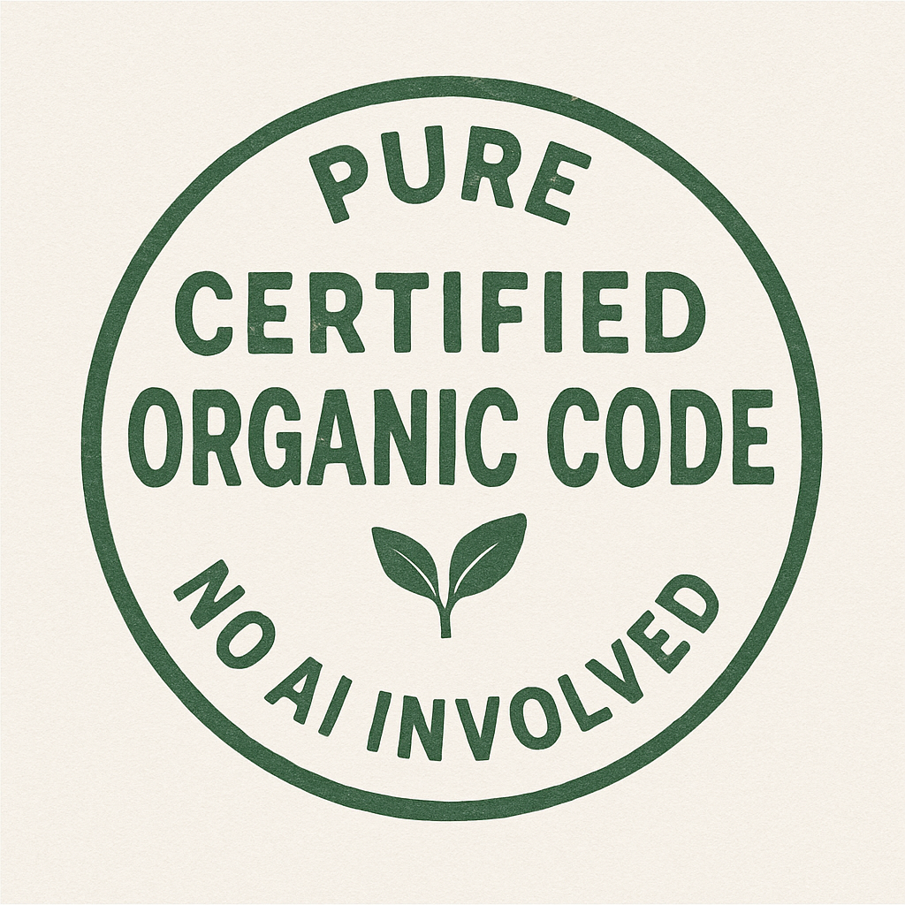

## So why this?

I expect a pretty serious backlash (hopefully not too disastrous consequences first, though maybe that'll sadly need to happen for the reconsideration to actually happen) against AI generated code.

_Maybe_ AI will get a lot better soon, but as of today (June 2025) it generates mostly garbage that _appears_ to mostly work... (for anything not completely trivial)

AI vibe coding is terrible and it will ruin an upcoming generation of new developers if we're not careful.

So anyway, at some point we'll need code that is guaranteed to have been hand crafted by a human, and this is what this sites wants to prepare for.

### But how?

How to find out a system or piece of code had no AI involved... is indeed very tricky. Maybe the author(s) solemnly swear it's the case? maybe some sort of licensing board for practitioners? audits?

I don't know... ideas welcome...

### (Certified) Organic code - No AI involved stamp:

Would be nice to have something like this on some hand crafted software:

### See also

[Low Background Web](low-background)
